<!-- yoctui-header -->
<p align="center">
  
</p>

<p align="center">
  <a href="https://github.com/0xbadcaffe/yoctui/actions/workflows/ci.yml"></a>
  <a href="docs/testing.md#completion-gate"></a>
  <a href="https://crates.io/crates/yoctui"></a>
  <a href="#install"></a>
  <br>
  <a href="LICENSE"></a>
  <a href="docs/operator-guide.md"></a>
  <a href="#install"></a>
  <a href="https://github.com/0xbadcaffe/yoctui/issues"></a>
</p>

<p align="center">
  <a href="docs/operator-guide.md">Docs</a> ·
  <a href="#install">Install</a> ·
  <a href="#features">Features</a> ·
  <a href="#quickstart-poky-build-environment">Quickstart</a> ·
  <a href="https://github.com/0xbadcaffe/yoctui">GitHub</a> ·
  <a href="https://github.com/0xbadcaffe/yoctui/issues">Issues</a>
</p>
<!-- /yoctui-header -->

# Yoctui

Yoctui is a terminal application for Yocto and BitBake development. It runs
builds, shows tasks and logs, edits recipes and sources, inspects generated
images, and manages development terminals.

<p align="center">
  <a href="docs/media/screenshots/07-idle-dashboard.png"></a>
</p>

The dashboard shows workspace status, recent jobs, build actions and host usage.
CPU, RAM and filesystem bars include percentages and capacity values.

[Install](#install) · [Set up Poky](#quickstart-poky-build-environment) ·
[Screenshots](#screenshots) · [Features](#features) · [Operator guide](docs/operator-guide.md)

## Install

Use a Linux terminal of at least 80×24, Python 3, and a recent stable Rust/Cargo.
Install the host packages required by your chosen Yocto release separately.

From crates.io:

```sh
cargo install yoctui --locked
yoctui --version
yoctui --help
```

From source:

```sh
export YOCTUI_DIR="$HOME/projects/yoctui"
git clone https://github.com/0xbadcaffe/yoctui.git "$YOCTUI_DIR"
cd "$YOCTUI_DIR"
cargo install --locked --path crates/yoctui-cli --force
type -a yoctui
yoctui --version
```

Make sure Cargo's binary directory is on your PATH. An already-running client
or daemon keeps its old executable until restarted. Do not restart a daemon
with active builds or terminal sessions merely to refresh the version.

## Quickstart: Poky build environment

For a complete Poky checkout with `oe-init-build-env` at its root:

```sh
export POKY_DIR="$HOME/src/poky"
export BUILDDIR="$POKY_DIR/build-yoctui"
test -f "$POKY_DIR/oe-init-build-env" || {
  echo "Missing oe-init-build-env; check the source layout."
  exit 1
}
source "$POKY_DIR/oe-init-build-env" "$BUILDDIR"
yoctui daemon start
yoctui --backend bridge --build-dir "$BUILDDIR"
```

For a split checkout, the script may instead be at
`$POKY_DIR/layers/openembedded-core/oe-init-build-env`. Source that script with
the same build directory. Use a vendor-provided setup wrapper when the BSP
requires one.

Start the daemon from the initialized shell. `daemon start` does not retarget
an existing daemon to a different build directory; check `yoctui daemon status`
before switching workspaces.

To launch a build, press `B`, edit the target with `e`, enter
`core-image-minimal`, and confirm the build action. Opening Yoctui does not
start a build.

### Configure paths inside Yoctui

Start `yoctui` without a configured environment and open **Build environment**:

1. Press `e` to open the Source/Build/Script form.
2. Select Source or Build with Tab. Press `b` to browse or `e` to type/paste.
3. In the browser, Enter/Right opens a folder; Left/Backspace goes up.
   Arrow keys, mouse wheel, PageUp/PageDown and Home/End move the selection.
   Press `s` to choose the current directory.
4. Choosing Source detects the usual environment script. Edit Script manually
   for a custom wrapper. The build directory must already exist.
5. Press `s` to save the form, then `V` to initialize and verify.
   Esc discards the current edit/browser or closes the draft.

Browsing and saving do not start a daemon or execute the setup script.
`A` opens the advanced TOML editor. Persistent daemon sessions still require
starting the daemon from an initialized shell as shown above.

## Navigation

| Key | Action |
| --- | --- |
| `F1` / `?` | Help |
| `F2` / `F3` / `F4` | Tasks / History / Dashboard |
| `F5` / `F6` / `F7` / `F8` | Logs / Layers / Recipes / Images |
| `F9` / `Ctrl+P` | Command palette |
| `F10` / `a` | Application menu / context actions |
| `Tab` / `Shift+Tab` | Change focus; some workspaces use Tab for their views |
| Arrows, `PageUp`/`PageDown`, `Home`/`End` | Move within lists and trees |
| `Right` / `Enter` in Navigator | Expand a group, then open and focus its workspace |
| `Left` in a tree | Collapse or move to parent |
| `Esc` | Close the active context, return to Navigator, then Dashboard |
| `/` | Search build-file contents, generated rootfs and text image artifacts; opens empty (outside editors and local search fields) |
| `B` | Image build options |
| `q` | Request exit; confirmation required |

The footer lists shortcuts for the current view. Dialogs and editors own
their keys before global navigation. Terminal writers retain normal keys; use
`Ctrl+B` for Yoctui terminal controls. See the [keymap](docs/keymap.md) for
terminal-prefix commands and custom bindings.

## Screenshots

Screens use fixture values rendered through Yoctui at `160x50`. GitUI panes
replay native output from a demo repository. For live build captures and image
checksums, see [Raster provenance](docs/media/screenshots/manifest.toml),
[Recorded live capture](artifacts/release-quality/next-generation-ui/manifest.json),
[Completed live build](docs/media/yoctui-live-completion.svg) and
[Failed live build](docs/media/yoctui-live-failed-task.svg).

### Set up a workspace

<table>
  <tr>
    <td width="50%"><a href="docs/media/screenshots/13-cloning.png">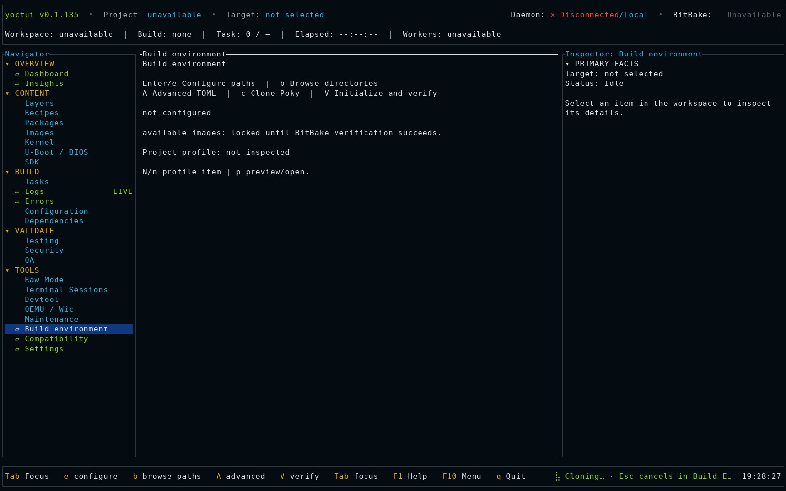</a><br><strong>Clone sources</strong> — Background cloning with a Braille <code>Cloning…</code> indicator.</td>
    <td width="50%"><a href="docs/media/screenshots/18-offline-dashboard.png">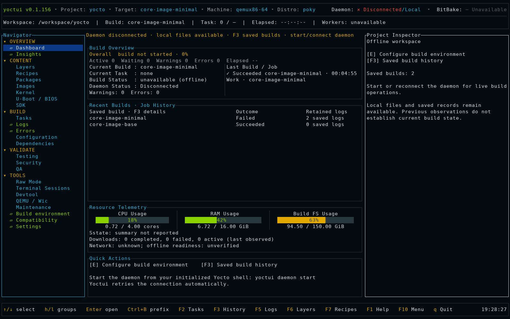</a><br><strong>Offline dashboard</strong> — Configure paths, reconnect the daemon or open saved builds.</td>
  </tr>
</table>

### Build and debug

<table>
  <tr>
    <td width="50%"><a href="docs/media/screenshots/01-active-build-tasks.png"></a><br><strong>Tasks</strong> — Active BitBake tasks, build progress and task logs.</td>
    <td width="50%"><a href="docs/media/screenshots/08-failed-build-errors.png"></a><br><strong>Errors</strong> — Failed tasks, diagnostics, source logs and recovery actions.</td>
  </tr>
  <tr>
    <td width="50%"><a href="docs/media/screenshots/14-cancelling.png">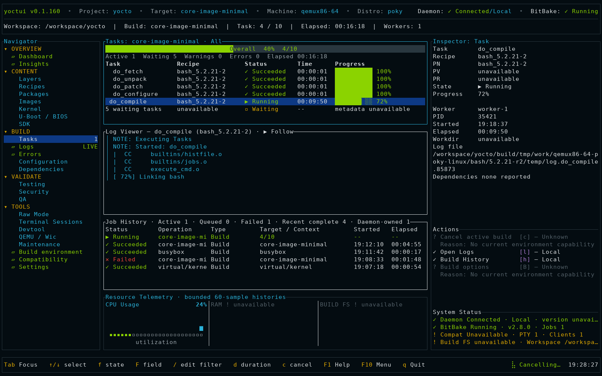</a><br><strong>Cancel a build</strong> — Cancellation runs in the background; navigation stays available.</td>
    <td width="50%"><a href="docs/media/screenshots/15-search-empty.png">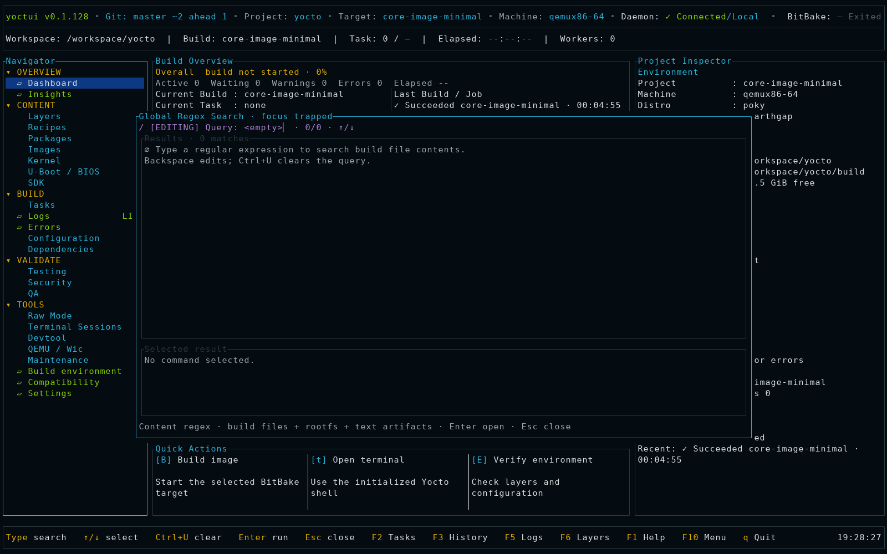</a><br><strong>Search build output</strong> — <code>/</code> opens an empty search of build files, generated rootfs and text image artifacts.</td>
  </tr>
</table>

### Read previous builds

<table>
  <tr>
    <td width="50%"><a href="docs/media/screenshots/19-saved-build-history.png">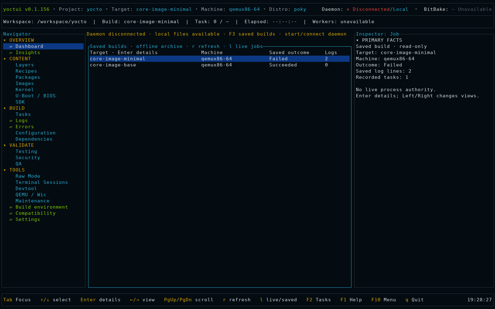</a><br><strong>Build history</strong> — Browse saved outcomes without a configured environment or daemon connection.</td>
    <td width="50%"><a href="docs/media/screenshots/20-saved-build-logs.png">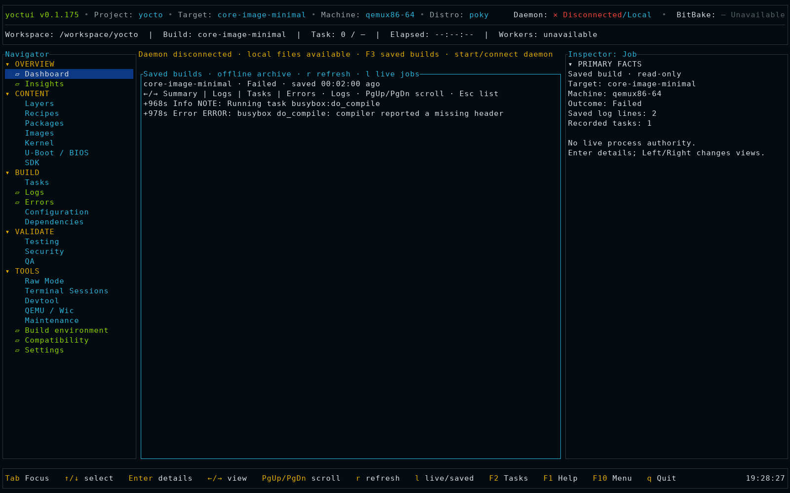</a><br><strong>Saved logs and tasks</strong> — Read retained build details and log excerpts; missing records and retention limits are shown.</td>
  </tr>
</table>

### Edit sources and commit changes

<table>
  <tr>
    <td width="50%"><a href="docs/media/screenshots/09-editor-application-menu.png"></a><br><strong>Recipe editor and menus</strong> — Syntax highlighting, validation and context actions. Use arrows to navigate menus and Escape to return; unavailable actions show the reason.</td>
    <td width="50%"><a href="docs/media/screenshots/10-terminal-sessions.png"></a><br><strong>Terminal sessions</strong> — Split build shells and devshells with writer control and scrollback.</td>
  </tr>
  <tr>
    <td width="50%"><a href="docs/media/screenshots/16-gitui-diff.png">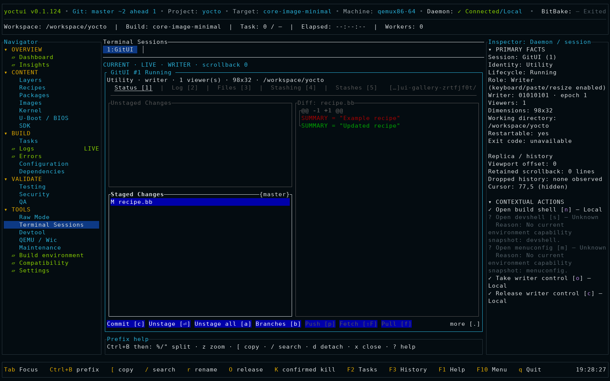</a><br><strong>Git status and diffs</strong> — Repository status in the header; native GitUI for reviewing and staging changes.</td>
    <td width="50%"><a href="docs/media/screenshots/17-gitui-commit.png">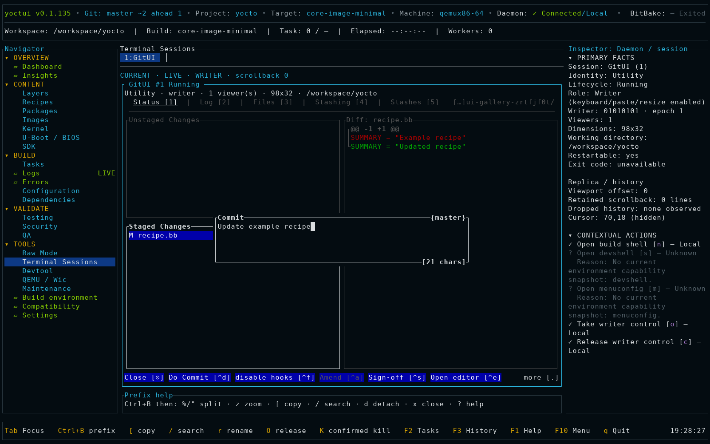</a><br><strong>Commit changes</strong> — Enter commit messages in GitUI inside a Yoctui terminal.</td>
  </tr>
</table>

### Configure the kernel and bootloader

<table>
  <tr>
    <td width="50%"><a href="docs/media/screenshots/02-kernel-device-tree.png"></a><br><strong>Kernel device trees</strong> — DTS, DTSI and compiled DTB files for the selected provider.</td>
    <td width="50%"><a href="docs/media/screenshots/03-uboot-device-tree.png"></a><br><strong>U-Boot device trees</strong> — Bootloader sources and generated device-tree artifacts.</td>
  </tr>
  <tr>
    <td width="50%"><a href="docs/media/screenshots/04-kernel-menuconfig.png"></a><br><strong>Kernel menuconfig</strong> — Native ncurses controls in a daemon-owned terminal.</td>
    <td width="50%"><a href="docs/media/screenshots/05-uboot-menuconfig.png"></a><br><strong>U-Boot menuconfig</strong> — The selected provider’s ncurses interface in a reconnectable PTY.</td>
  </tr>
  <tr>
    <td width="50%"><a href="docs/media/screenshots/11-device-tree-editor.png">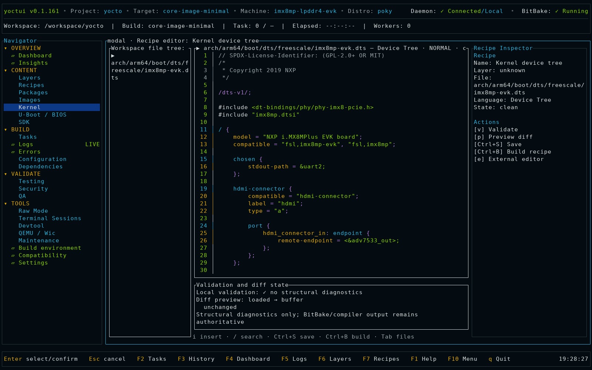</a><br><strong>Device Tree editor</strong> — Linux v6.6 <a href="https://github.com/torvalds/linux/blob/v6.6/arch/arm64/boot/dts/freescale/imx8mp-evk.dts">NXP i.MX8MP EVK DTS</a>, with highlighted directives, nodes, properties, values and comments.</td>
    <td width="50%"><a href="docs/media/screenshots/12-device-tree-compile-options.png">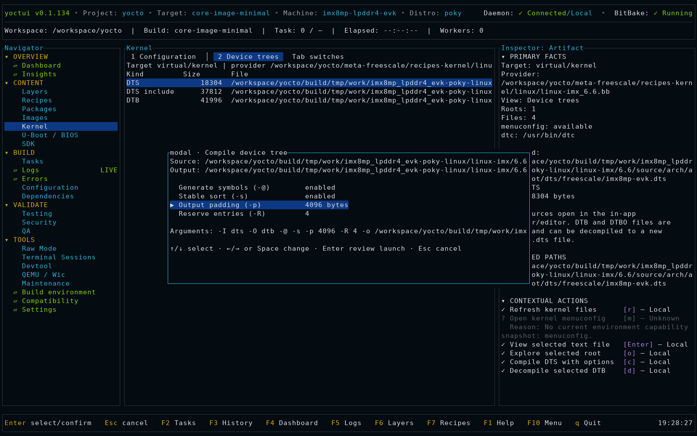</a><br><strong>Device Tree compiler</strong> — Set symbols, sorting, padding and reserve entries, then review the exact <code>dtc</code> command.</td>
  </tr>
</table>

### Inspect the generated image

<table>
  <tr>
    <td width="50%"><a href="docs/media/screenshots/06-rootfs-composition.png"></a><br><strong>Rootfs composition</strong> — Braille package-size chart with matching table colors, exact byte totals and filesystem drill-down.</td>
    <td width="50%"><a href="docs/media/screenshots/21-systemd-services.png">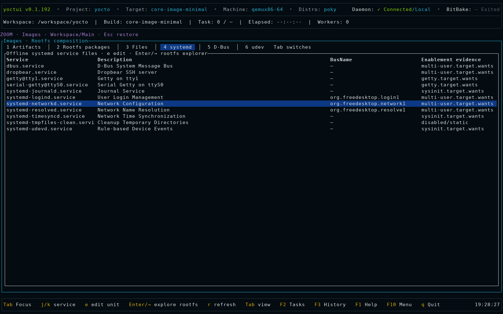</a><br><strong>Offline systemd services</strong> — Inspect unit files, D-Bus names and enablement links in <code>IMAGE_ROOTFS</code>. These are installed files, not live service status.</td>
  </tr>
  <tr>
    <td width="50%"><a href="docs/media/screenshots/22-system-dbus.png">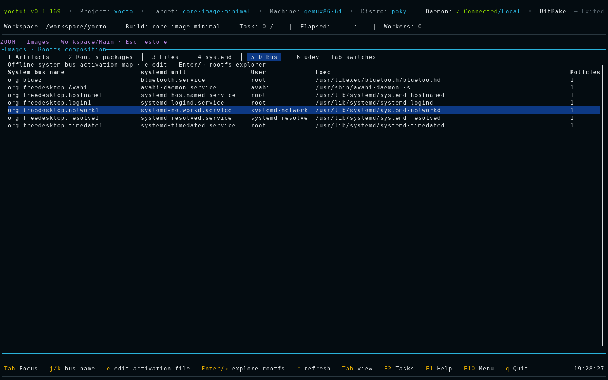</a><br><strong>System D-Bus</strong> — Inspect activation files, associated systemd units and policy files from the image.</td>
    <td width="50%"><a href="docs/media/screenshots/23-udev-rules.png">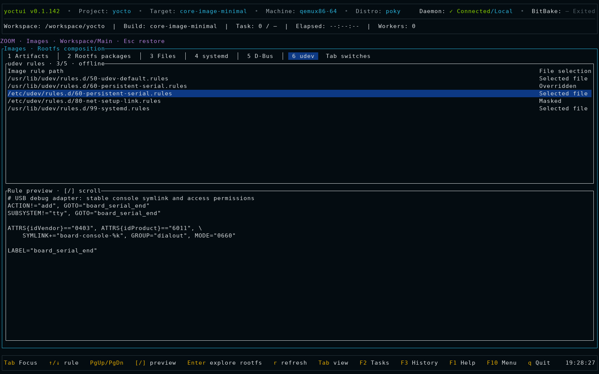</a><br><strong>udev rules</strong> — Check file precedence, overrides and masks, then read the selected rule. Rules are not executed.</td>
  </tr>
</table>

## Build, logs and errors

1. Use `B` for an image build, or `b` on a selected recipe.
2. Open Tasks with `F2`; use its filters to inspect active or failed tasks.
3. Open Logs with `F5`. `f` resumes live follow; navigation pauses follow.
   `w` toggles wrapping. Context actions expose local search and filters.
4. Open Errors from the Navigator to inspect failures and their source logs.
5. Use the cancel action and confirm it to stop a build. Exiting the client is
   separate from cancelling a daemon-owned build.

Logs show output acquired by Yoctui, not every log file on the host.
Retention is bounded. [Log controls and limits](docs/yocto-logs.md).

## Offline use and saved builds

Screens remain reachable without a configured build environment or a connected
daemon. Setup and connection are separate: local source files and Git can remain
usable while live build actions are unavailable. Disconnected screens label retained
data as last observed; they do not claim a build is idle or successful.

| Connection state | Available work |
| --- | --- |
| No environment | Configure/clone, saved builds, Settings and Help |
| Configured, disconnected | Local files and Git, retained information and saved history |
| Connected, idle | Supported workflows and build launch |
| Connection lost | Last-observed data with its update age, saved history and automatic reconnect |

Press **F3** for history. **Up/Down** selects a saved build; **Enter** opens details.
Use **Left/Right** for Summary, Logs, Tasks and Errors; **PgUp/PgDn** scrolls;
**Esc** returns to the list. **r** reloads saved records and **l** switches between
saved records and live job history when connected. Saved history is read-only
and separate from live task and log views.

The daemon saves builds without an attached client. It checkpoints active
builds every 30 seconds and terminal transitions promptly in a background worker.
Storage is private under `$XDG_STATE_HOME/yoctui/build-history/history.json`
(default `~/.local/state/yoctui/build-history/history.json`). Retention is bounded
to **32 builds and 8 MiB**, with at most **256 log records and 256 task rows per build**.
Each message is limited to 4096 UTF-8 bytes. These are saved excerpts, not complete
transcripts. Legacy builds show summaries when logs or task details were never saved.
A failure record states when the backend did not preserve a distinct cancellation
outcome. Incomplete records are last observations, never proof of a running build.

Offline startup does not run BitBake metadata probes. On the Dashboard, **E** opens
Build Environment and **F3** opens history. To connect, start the daemon
from your initialized Yocto shell with `yoctui daemon start`; the client retries
automatically. Daemons older than v0.1.118 must be restarted after active work
finishes to enable history checkpoints.

GitUI requires a selected source repository, but no build environment verification.
Without a daemon, its launch preview offers the current terminal; quitting GitUI
restores Yoctui. A detected detached terminal is also available.

## Edit recipes and develop a patch

In Layers, Enter opens a layer tree, Right/Left expands/collapses directories,
and PageUp/PageDown moves through it. The selected text file appears beside
the tree; `[`/`]` scrolls a long preview.

In Recipes:

1. Select a recipe. Enter loads its details; `e` opens the provider for editing.
2. Use `t` to refresh Devtool status and `d` to review `devtool modify` or
   open its existing source workspace.
3. Edit the source and save with `Ctrl+S`. The editor provides syntax
   highlighting, navigation, search, undo/redo and a diff view. It does not
   provide LSP support or VS Code extensions.
4. Press `Ctrl+B` from the saved editor to review a build of that recipe.
5. Use `u` for `devtool update-recipe`, or commit the source changes and use
   `F` for `devtool finish` into a selected layer. Review the destination and
   changes before confirming.
6. Inspect the generated patch and recipe/bbappend, then rebuild the recipe.

Use `p` to inspect recipe patches and `o` for task logs. `P` previews
deployment and `D` previews a destructive Devtool reset.
Shell/devshell/menuconfig actions offer an embedded session or a detached
terminal when supported. External editing restores Yoctui after the editor
exits. [Editing and Devtool details](docs/operator-guide.md#recipes-and-devtool).

## Source Git status

The global header shows the selected source repository and its Git state:
`+N` staged, `~N` unstaged, `?N` untracked, and `!N` conflicted files.
Ahead/behind counts compare against the last fetched upstream; `synced*` means
those recorded commits match. Local changes remain visible independently.
Repositories without an upstream are marked accordingly. Status refreshes in the background without fetching.

### GitUI

Install [GitUI](https://github.com/gitui-org/gitui#installation) on your `PATH`,
then restart Yoctui. Choose **F10 → Tools → Open GitUI**, or search for GitUI in
**Ctrl+P**. Review the source directory and choose the embedded terminal.
Press **o** to take writer control. GitUI provides diffs, staging, commit messages,
branch management, fetch and push; its footer shows the active keys.
Use **Ctrl+B t** for the session list. Git status refreshes automatically.


## Search source code and generated content

Press `/` and enter a case-insensitive Rust regex, for example
`systemd|udev`. Search opens empty and matches text file contents under the
build directory, generated rootfs and text image artifacts. This includes build
logs, pkgdata and generated metadata; recipes (`.bb`, `.bbappend`, `.inc`),
configuration, classes, layer scripts, Poky and BitBake sources are searched
when present under those directories. An installed service file can match by
its contents in a retained rootfs. Use `Ctrl+P` to find actions.

Results show file/line and image origin where known; Enter opens the result.
The search skips symlinks, binary/oversized files, downloads, sstate and other
large caches, and returns at most 500 hits. It is not an exhaustive disk index.
Editors and terminals retain literal `/`; use their own search controls.

## Kernel, firmware and build analysis

Open **Kernel** or **U-Boot / BIOS** in the Navigator. Tab switches Configuration
and Device trees. Enter/`e` opens a text file; `m` opens menuconfig when the
selected provider supports it. Kernel and U-Boot menuconfig retain their native
ncurses layout, colors and key handling inside Terminal Sessions. The selected
session uses the full workspace beside the Navigator, omits the passive
Inspector and prefix-help rail, and resizes its PTY to the visible split pane.
The editor recognizes DTS/DTSI syntax and highlights directives, nodes,
properties, values and comments. With `dtc` available, `c` opens compile
options for symbols, stable sorting, padding and reserve entries before the
command preview; `d` decompiles DTB/DTBO. Output uses a
`.yoctui` name and refuses overwrites.
[Kernel and firmware guide](docs/platform-workbenches.md).

Open **Overview → Insights** and choose `1`–`8` for timeline, rebuild causes,
sstate/downloads, image size, metadata provenance, package dependencies,
supply-chain coverage or disk history. These views use loaded data; missing
timestamps or reports are not estimates.

Use Dependencies for recipe/task graphs. In Recipes, `Z` opens signature
history; choose two sides with `1`/`2` and compare with `c`. Configuration
shows effective values and their source files. Reviewed edits target supported
assignments in `conf/local.conf`, rather than rewriting arbitrary metadata.

## Inspect an image, its packages and rootfs

Open Images with `F8`. Select a deployed artifact, press `R` to rescan if
needed, and use the numbered views:

| Key | View |
| --- | --- |
| `1` | Deployed artifacts |
| `2` | Installed packages and size pie chart |
| `3` | Rootfs filesystem |
| `4` | Systemd services |
| `5` | System D-Bus |
| `6` | udev rules |

Package composition needs the selected image's manifest and generated pkgdata.
The filesystem, services, D-Bus and udev views need its retained
`IMAGE_ROOTFS`. Yoctui does not automatically mount or extract ext4/Wic images.
With `rm_work`, package information may remain while filesystem data is gone.

The udev view lists rules, overrides and masks; `[`/`]` scrolls the preview.
Service and D-Bus views describe installed files, not live unit/bus state.
The udev view does not execute rules. Changes made directly to staged rootfs files can be
overwritten by BitBake; make lasting changes in a recipe or layer.

The pie chart retains an exact size table and falls back to tables in narrow
or accessible layouts. [Rootfs details](docs/rootfs-composition.md).

## Boot with QEMU or connect over SSH

With an image artifact selected, press `T` in Images:

- **Boot with QEMU:** review the image and options. The embedded console uses
  `runqemu` with `nographic` and `serialstdio`.
- **Connect over SSH:** enter the host, user, port and optional identity file.
  This connects to a running target; it does not boot it. OpenSSH's host-key
  checks remain enabled.

Confirming creates a daemon-owned Terminal Session. `Ctrl+B`, then `o`,
takes writer control. `Q` opens the advanced QEMU options.

| Prefix sequence | Action |
| --- | --- |
| `Ctrl+B c` | Create a build shell |
| `Ctrl+B n` / `Ctrl+B p` | Next / previous session |
| `Ctrl+B %` / `Ctrl+B "` | Split panes |
| `Ctrl+B z` | Zoom pane |
| `Ctrl+B [` / `Ctrl+B /` | Copy / search |
| `Ctrl+B d` | Detach client; keep the process |
| `Ctrl+B K` | Confirm process termination |
| `Ctrl+B ?` | Prefix help |

Press the prefix and its command separately. `!` opens an inherited shell
outside the TUI; exit that shell to return.
[Terminal sessions](docs/embedded-shell.md).

## SDK, Wic, tests, security and maintenance

- **SDK:** `s`/`E` reviews standard/extensible SDK builds; `t`/`T` reviews
  SDK tests; `R` rescans installers; `P` reviews publication; `n` opens native
  tools. Actions use the active image, machine and distro.
- **Wic:** `W` in Images opens creation options. `D` reviews writing an eligible
  removable device, requiring the exact device phrase and confirmation.
  Yoctui does not invoke sudo for device writing.
- **Testing:** launch supported selftests, image/SDK tests or ptests; import
  results, compare runs and export JUnit. Review the operation before starting.
- **Security:** run supported CVE/SBOM tasks or import SPDX, CycloneDX JSON and
  legacy image manifests. A manifest supplies package/version information,
  not a full SBOM.
- **QA:** run available recipe/kernel checks or layer checks, then inspect
  findings and source locations.
- **Raw Mode:** select a command category and command, edit structured arguments,
  review the argv preview, then run. Keep common requests as favorites.
- **Maintenance:** use `[`/`]` to choose Sstate, Services, Release or
  Integrations. Cleanup requires an exact candidate preview and confirmation.
  Service diagnostics are observational; Integrations detects tools rather
  than automatically uploading reports or managing Toaster.

See the [operator guide](docs/operator-guide.md) for per-view controls and
prerequisites. These operations leave BitBake parallelism unchanged.

## Daemon and remote use

```sh
yoctui daemon status
yoctui attach
yoctui sessions
yoctui daemon build core-image-minimal
```

The daemon keeps jobs and PTYs alive when a client disconnects. Connect to the
build host over SSH, then run `yoctui attach` there; the daemon uses a local
per-user Unix socket, not a public TCP listener.

After all work has stopped, use `yoctui daemon restart` to load a newly installed
binary, or `yoctui daemon stop` to stop it. After a host reboot, lost child
processes are reported as Lost; saved metadata does not resurrect them.

Optional systemd user-service setup:

```sh
yoctui daemon service install
yoctui daemon service status
```

Arrange the required Yocto environment before starting the user service.
Installing a unit alone does not initialize a build environment.

## Settings and team profiles

Settings controls themes, mouse input, reduced motion, ASCII/no-color rendering
and keybindings. Preferences are local to the user.

A repository may also contain `.yoctui/project.toml`:

```toml
schema_version = 1

[favorites]
recipes = ["base-files"]
images = ["core-image-minimal"]
layers = ["core"]

[[build_presets]]
name = "minimal"
targets = ["core-image-minimal"]
machine = "qemux86-64"

[build_presets.options]
jobs = 8
continue_on_error = false

[[workflows]]
name = "refresh-metadata"

[[workflows.steps]]
type = "refresh_metadata"
```

Inspect it with `yoctui --build-dir "$BUILDDIR" profile`. Loading a profile does
not execute it. Profiles store shared names and build intent, not credentials,
host paths or shell hooks. Select a preset and review its request before running.

## Features

| Area | Features |
| --- | --- |
| Build environment | Source/build directory browser, manual path editing, environment-script detection, nested fresh-clone destinations, background cloning with Braille progress, initialization and connection checks |
| Dashboard and Tasks | Build/task state, progress, elapsed time, job history, background cancellation, CPU/RAM/filesystem bars, disk/network histories |
| Logs and Errors | Live follow/pause, filters, search, bookmarks, wrapping, horizontal scrolling, copy/export, task correlation and failure details; Yocto log panes use tui-logger |
| Layers and Recipes | Expandable layer tree using tui-tree-widget, provider/appends/tasks/patch inspection, syntax-aware file previews, source editing and external editors |
| Configuration | Effective values, overrides, provenance, scope comparison, reviewed local.conf edits and BBMASK |
| Dependencies and signatures | Recipe/task graphs, runtime dependencies, reverse traversal, why-built paths, signature inspection and diffsigs comparison |
| Devtool | Status, modify, source editing, recipe builds, update-recipe, finish into a layer, deploy and reset |
| Packages and Images | Generated pkgdata, installed packages, deployed artifacts, rootfs package pie chart using tui-piechart, filesystem tree, systemd units, system D-Bus configuration and udev rules |
| Kernel and firmware | Kernel and U-Boot/BIOS provider detection, configuration files, menuconfig, DTS/DTB/DTBO browsing and device-tree compile/decompile |
| Overview Insights | Timeline/critical path, rebuild causes, sstate/download outcomes, image size and retained size deltas, metadata provenance, package topology, supply-chain reports and disk history |
| Offline history | Saved build outcomes, machine, duration, bounded logs/tasks and missing-record notices; no daemon required |
| Source Git | Global branch, staged/unstaged/untracked/conflict and ahead/behind status; embedded GitUI diffs, staging and commits |
| Terminals | Daemon-owned shells, devshell/menuconfig, SSH and runqemu consoles using tui-term; split panes, resize, scrollback, copy/search and reconnect |
| SDK and Wic | Standard/extensible SDK builds and tests, installer inspection/publication, native tools, Wic creation and confirmed removable-device writing |
| Testing, Security and QA | Selftests, image/SDK tests, ptest, result comparison/JUnit export, CVE checks, SPDX/CycloneDX/manifest imports, recipe/kernel and layer checks |
| Raw Mode and Maintenance | Structured command catalog, argument previews, favorites/history, sstate checks/cleanup, PR/hash diagnostics, locked caches, buildhistory comparison and Git archives |
| Preferences and profiles | Color themes, reduced motion, ASCII/no-color views, keybindings, saved preferences, onboarding and optional team project profiles |

Actions depend on the connected Yocto environment and generated files.
Unavailable actions show the required tools, tasks or files.

## Compatibility and troubleshooting

Available actions depend on the connected Yocto environment’s tools, tasks
and configuration.

Yoctui functionality is Yocto-feature-correlated: the installed Yoctui binary
defines the operations it knows, while the connected Yocto/OpenEmbedded/BitBake
environment supplies the evidence that determines which operation is safe now.

Open Compatibility for detected versions and reasons for disabled actions:

```sh
yoctui --build-dir "$BUILDDIR" doctor
yoctui --build-dir "$BUILDDIR" doctor --json
```

Tested Yocto/BitBake combinations are Scarthgap 5.0.19 / BitBake 2.8.1 and Wrynose
6.0.2 / BitBake 2.18.0. Exact revisions, evidence expiry and host limits are in
the [compatibility matrix](docs/compatibility-matrix.md). Other versions need
their own checks; a version number alone does not establish support.

| Symptom | Check |
| --- | --- |
| Daemon unavailable | Start it from the initialized Yocto shell; check `yoctui daemon status` |
| Wrong workspace or old version | Check `type -a yoctui`, `yoctui --version` and the daemon's build directory; restart only when work is stopped |
| Packages unavailable after a build | Select the correct image and refresh; confirm its manifest and `tmp/pkgdata` still exist |
| No rootfs tree/services/udev | Confirm the reported `IMAGE_ROOTFS` was not cleaned; deploy artifacts alone are insufficient |
| Logs stop following | Press `f` in Logs; navigation pauses follow |
| Disabled workflow | Read its Compatibility reason and verify the required tool/task/configuration |
| Host overloaded or nearly full | Inspect telemetry and disk space; choose build parallelism/cleanup yourself |

## Performance evidence

This Flamegraph records userspace `perf` samples from the deterministic
large-metadata workload at v0.1.64 on September 6, 2026. It completed 6,000
frames with 2,403 real userspace samples, workload checksum
`95d507f9b14b71d6`, and zero unresolved frames. Rendering and model code have
changed since this capture. The historical measurements apply to v0.1.64, not
the current release.

<p align="center">
  <a href="artifacts/flamegraph/yoctui.svg"></a>
</p>

[Machine-readable summary](artifacts/flamegraph/summary.txt) ·
[Profiling method and current limits](docs/profiling.md)

Reproduce the current-source report on a Linux host that permits userspace
`perf` sampling:

```sh
cargo install flamegraph --locked
./scripts/flamegraph.sh
./scripts/test-flamegraph.sh
```

## Development and license

```sh
cargo build --locked -p yoctui
cargo fmt --all --check
cargo test --workspace --all-features
cargo clippy --workspace --all-targets --all-features -- -D warnings
python3 -m pytest bridge/tests
./scripts/test-readme-quickstart.sh
./scripts/verify-roadmap.sh
./scripts/verify-completion.sh
```

[Testing](docs/testing.md) · [Profiling](docs/profiling.md) ·
[Performance contract](docs/performance.md) · [UI specification](docs/ui-spec.md) ·
[Architecture](docs/architecture.md) · [Implementation status](docs/implementation-status.md)

Yoctui is [MIT-licensed](LICENSE). Dependency licenses are listed in
[third-party notices](docs/compliance/THIRD_PARTY_NOTICES.md).
The offline systemd service view was informed by the MIT-licensed
[systemd-manager-tui](https://github.com/Matheus-git/systemd-manager-tui) by
Matheus-git; Yoctui uses its own parser for unbooted images.
