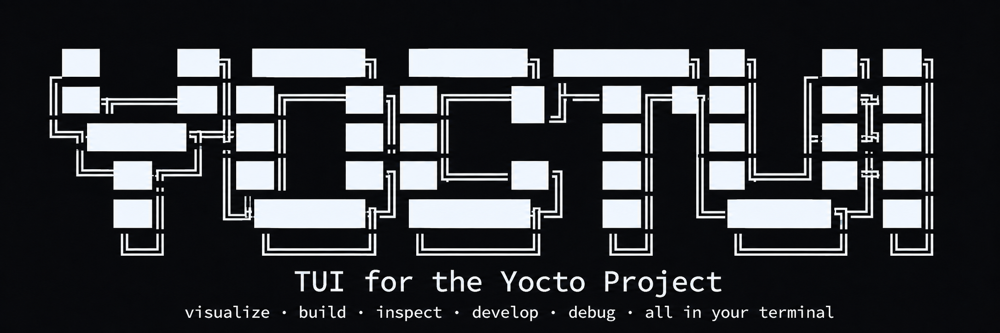
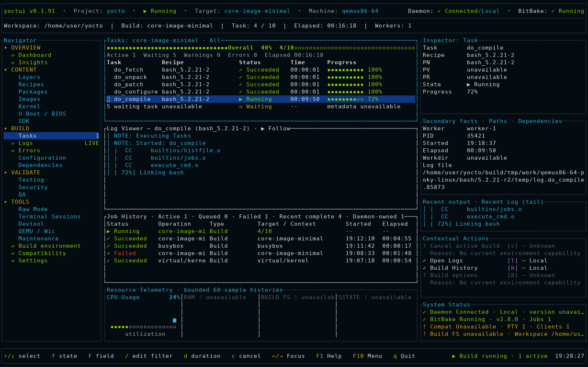
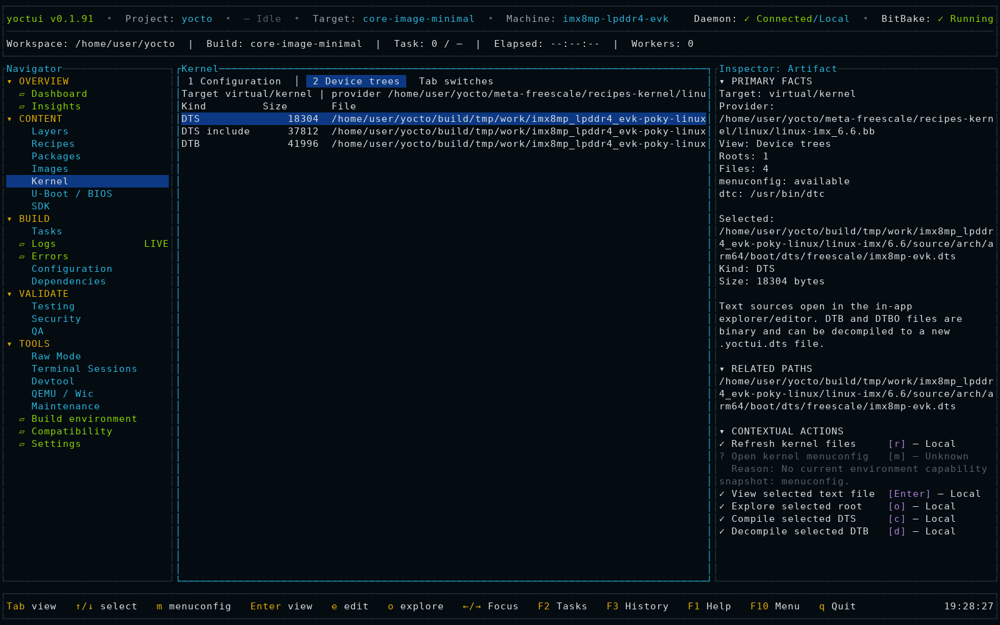
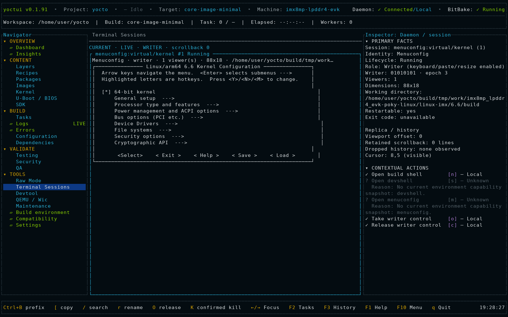
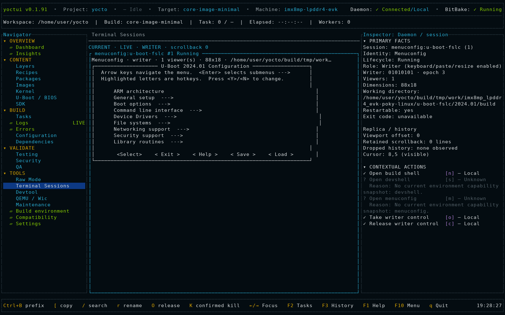
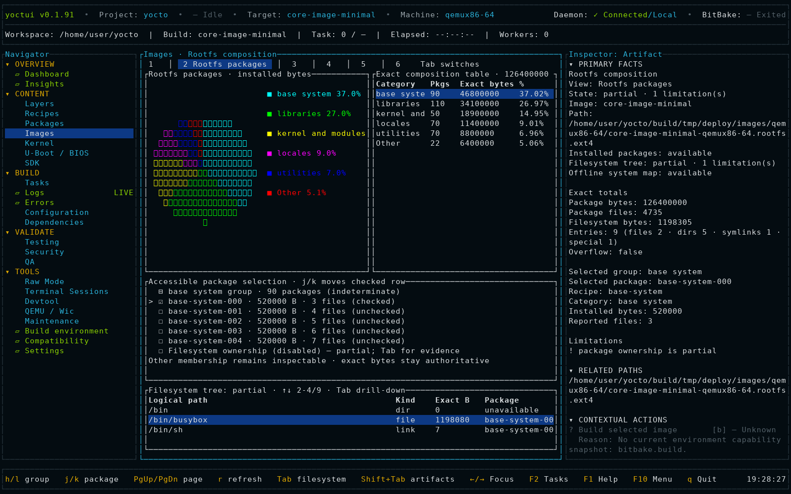
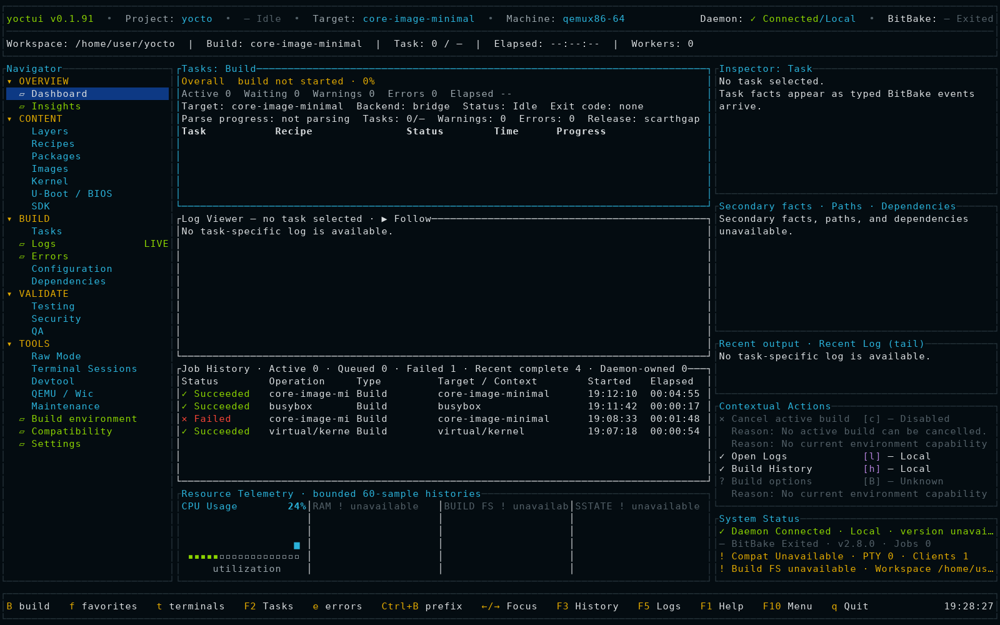
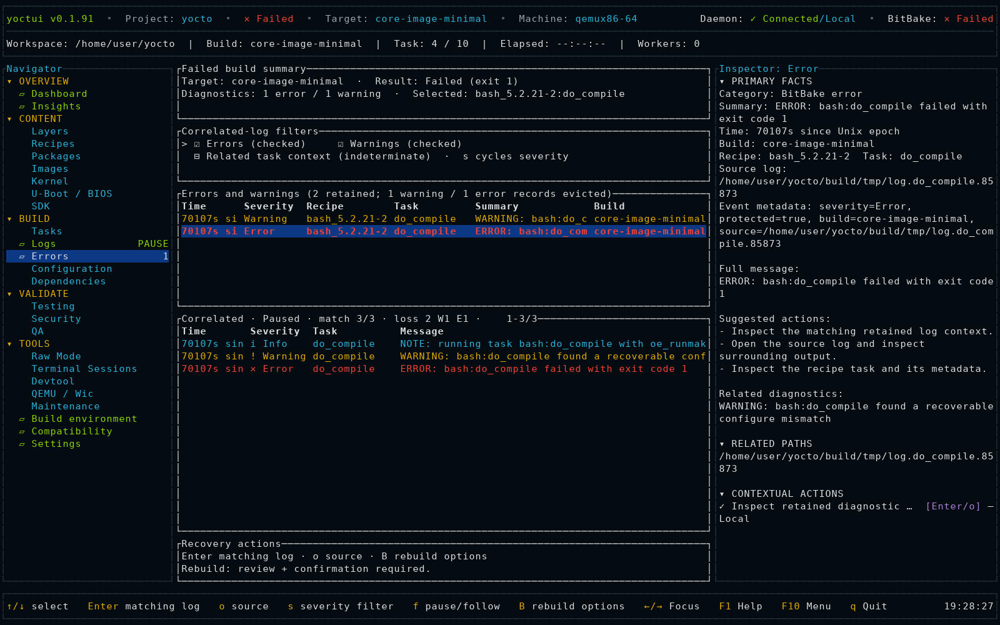
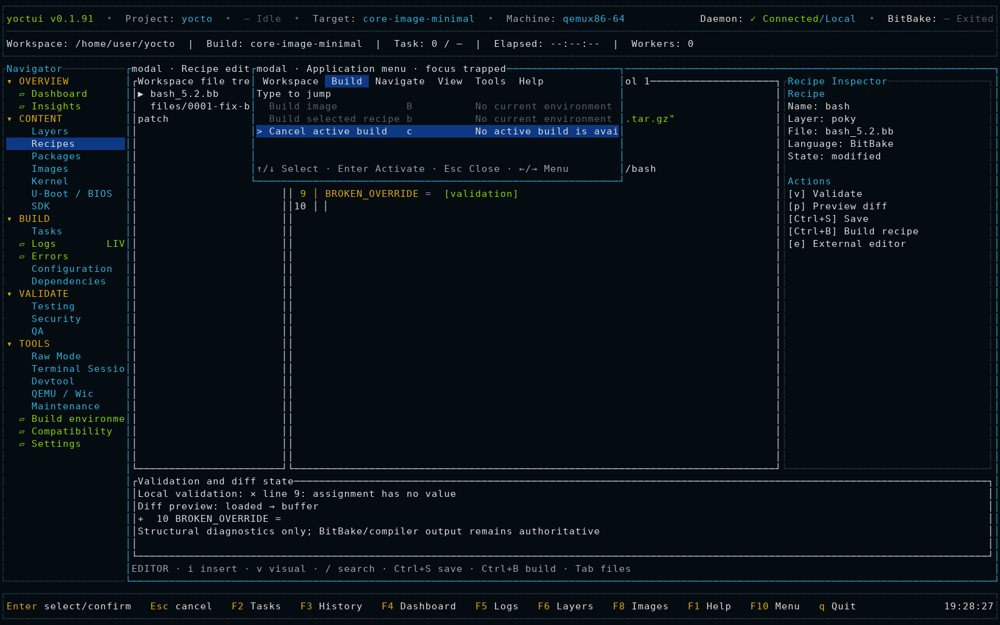
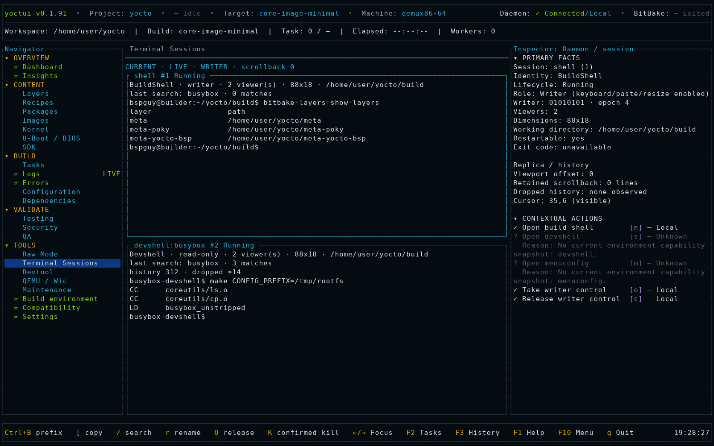

<!-- yoctui-header -->
<p align="center">
  
</p>

<p align="center">
  <a href="https://github.com/0xbadcaffe/yoctui/actions/workflows/ci.yml"></a>
  <a href="docs/testing.md#completion-gate"></a>
  <a href="https://crates.io/crates/yoctui"></a>
  <a href="#install"></a>
  <br>
  <a href="LICENSE"></a>
  <a href="docs/operator-guide.md"></a>
  <a href="#install"></a>
  <a href="https://github.com/0xbadcaffe/yoctui/issues"></a>
</p>

<p align="center">
  <a href="docs/operator-guide.md">Docs</a> ·
  <a href="#install">Install</a> ·
  <a href="#features">Features</a> ·
  <a href="#quickstart-poky-build-environment">Examples</a> ·
  <a href="https://github.com/0xbadcaffe/yoctui">GitHub</a> ·
  <a href="https://github.com/0xbadcaffe/yoctui/issues">Issues</a>
</p>
<!-- /yoctui-header -->

# Yoctui

Yoctui is a terminal application for Yocto and BitBake development. It runs
builds, shows tasks and logs, edits recipes and sources, inspects generated
images, and manages development terminals.

This README describes the source checkout. The crates.io release may be older;
check `yoctui --version` and the [release status](docs/implementation-status.md).

<p align="center">
  <a href="docs/media/screenshots/01-active-build-tasks.png"></a>
</p>

Current production-renderer screenshot. The deterministic gallery below is
generated from reviewed `160x50` Ratatui cell/style captures; it demonstrates
implemented UI flows without claiming a live build for the fixture values.
[Raster provenance](docs/media/screenshots/manifest.toml) ·
[Recorded live capture](artifacts/release-quality/next-generation-ui/manifest.json) ·
[Completed live build](docs/media/yoctui-live-completion.svg) ·
[Failed live build](docs/media/yoctui-live-failed-task.svg)

## Screenshots

<table>
  <tr>
    <td width="50%"><a href="docs/media/screenshots/02-kernel-device-tree.png"></a><br><strong>Kernel device trees</strong> — provider-aware DTS, DTSI and compiled DTB inventory.</td>
    <td width="50%"><a href="docs/media/screenshots/03-uboot-device-tree.png"></a><br><strong>U-Boot device trees</strong> — bootloader sources and generated device-tree artifacts.</td>
  </tr>
  <tr>
    <td><a href="docs/media/screenshots/04-kernel-menuconfig.png"></a><br><strong>Kernel menuconfig</strong> — daemon-owned interactive configuration in the embedded terminal.</td>
    <td><a href="docs/media/screenshots/05-uboot-menuconfig.png"></a><br><strong>U-Boot menuconfig</strong> — provider-specific bootloader configuration with reconnectable PTY ownership.</td>
  </tr>
  <tr>
    <td><a href="docs/media/screenshots/06-rootfs-composition.png"></a><br><strong>Image composition</strong> — rootfs package pie chart, exact byte totals and filesystem drill-down.</td>
    <td><a href="docs/media/screenshots/07-idle-dashboard.png"></a><br><strong>Dashboard</strong> — workspace status, recent jobs, quick actions and host telemetry.</td>
  </tr>
  <tr>
    <td><a href="docs/media/screenshots/08-failed-build-errors.png"></a><br><strong>Errors</strong> — retained diagnostics, task correlation and recovery actions.</td>
    <td><a href="docs/media/screenshots/09-editor-application-menu.png"></a><br><strong>Recipe editing</strong> — syntax-aware source editing, validation and contextual actions.</td>
  </tr>
  <tr>
    <td colspan="2"><a href="docs/media/screenshots/10-terminal-sessions.png"></a><br><strong>Terminal sessions</strong> — split build shells and devshells with explicit writer control and scrollback.</td>
  </tr>
</table>

## Features

| Area | Features |
| --- | --- |
| Build environment | Source/build directory browser, manual path editing, environment-script detection, clone preview, initialization and connection checks |
| Dashboard and Tasks | Build/task state, progress, elapsed time, job history, cancellation, CPU/RAM/filesystem meters, disk/network histories |
| Logs and Errors | Live follow/pause, filters, search, bookmarks, wrapping, horizontal scrolling, copy/export, task correlation and failure details; Yocto log panes use tui-logger |
| Layers and Recipes | Expandable layer tree using tui-tree-widget, provider/appends/tasks/patch inspection, syntax-aware file previews, source editing and external editors |
| Configuration | Effective values, overrides, provenance, scope comparison, reviewed local.conf edits and BBMASK |
| Dependencies and signatures | Recipe/task graphs, runtime dependencies, reverse traversal, why-built paths, signature inspection and diffsigs comparison |
| Devtool | Status, modify, source editing, recipe builds, update-recipe, finish into a layer, deploy and reset |
| Packages and Images | Generated pkgdata, installed packages, deployed artifacts, rootfs package pie chart using tui-piechart, filesystem tree, systemd units, system D-Bus configuration and udev rules |
| Kernel and firmware | Kernel and U-Boot/BIOS provider detection, configuration files, menuconfig, DTS/DTB/DTBO browsing and device-tree compile/decompile |
| Overview Insights | Timeline/critical path, rebuild causes, sstate/download outcomes, image size and retained size deltas, metadata provenance, package topology, supply-chain reports and disk history |
| Terminals | Daemon-owned shells, devshell/menuconfig, SSH and runqemu consoles using tui-term; split panes, resize, scrollback, copy/search and reconnect |
| SDK and Wic | Standard/extensible SDK builds and tests, installer inspection/publication, native tools, Wic creation and confirmed removable-device writing |
| Testing, Security and QA | Selftests, image/SDK tests, ptest, result comparison/JUnit export, CVE checks, SPDX/CycloneDX/manifest imports, recipe/kernel and layer checks |
| Raw Mode and Maintenance | Structured command catalog, argument previews, favorites/history, sstate checks/cleanup, PR/hash diagnostics, locked caches, buildhistory comparison and Git archives |
| Preferences and profiles | Color themes, reduced motion, ASCII/no-color views, keybindings, saved preferences, onboarding and optional team project profiles |

Actions depend on the connected Yocto environment and generated files.
Unavailable actions show their prerequisites; a feature listed here is not a
promise that every Poky release provides it.

## Install

Use a Linux terminal of at least 80×24, Python 3, and a recent stable Rust/Cargo.
Install the host packages required by your chosen Yocto release separately.

From crates.io:

```sh
cargo install yoctui --locked
yoctui --version
yoctui --help
```

From source:

```sh
export YOCTUI_DIR="$HOME/projects/yoctui"
git clone https://github.com/0xbadcaffe/yoctui.git "$YOCTUI_DIR"
cd "$YOCTUI_DIR"
cargo install --locked --path crates/yoctui-cli --force
type -a yoctui
yoctui --version
```

Make sure Cargo's binary directory is on your PATH. An already-running client
or daemon keeps its old executable until restarted. Do not restart a daemon
with active builds or terminal sessions merely to refresh the version.

## Quickstart: Poky build environment

For a complete Poky checkout with `oe-init-build-env` at its root:

```sh
export POKY_DIR="$HOME/src/poky"
export BUILDDIR="$POKY_DIR/build-yoctui"
test -f "$POKY_DIR/oe-init-build-env" || {
  echo "Missing oe-init-build-env; check the source layout."
  exit 1
}
source "$POKY_DIR/oe-init-build-env" "$BUILDDIR"
yoctui daemon start
yoctui --backend bridge --build-dir "$BUILDDIR"
```

For a split checkout, the script may instead be at
`$POKY_DIR/layers/openembedded-core/oe-init-build-env`. Source that script with
the same build directory. Use a vendor-provided setup wrapper when the BSP
requires one.

Start the daemon from the initialized shell. `daemon start` does not retarget
an existing daemon to a different build directory; check `yoctui daemon status`
before switching workspaces.

To launch a build, press `B`, edit the target with `e`, enter
`core-image-minimal`, and confirm the build action. Opening Yoctui does not
start a build.

### Configure paths inside Yoctui

Start `yoctui` without a configured environment and open **Build environment**:

1. Press `e` to open the Source/Build/Script form.
2. Select Source or Build with Tab. Press `b` to browse or `e` to type/paste.
3. In the browser, Enter/Right opens a folder; Left/Backspace goes up.
   Arrow keys, mouse wheel, PageUp/PageDown and Home/End move the selection.
   Press `s` to choose the current directory.
4. Choosing Source detects the usual environment script. Edit Script manually
   for a custom wrapper. The build directory must already exist.
5. Press `s` to save the form, then `V` to initialize and verify.
   Esc discards the current edit/browser or closes the draft.

Browsing and saving do not start a daemon or execute the setup script.
`A` opens the advanced TOML editor. Persistent daemon sessions still require
starting the daemon from an initialized shell as shown above.

## Navigation

| Key | Action |
| --- | --- |
| `F1` / `?` | Help |
| `F2` / `F3` / `F4` | Tasks / History / Dashboard |
| `F5` / `F6` / `F7` / `F8` | Logs / Layers / Recipes / Images |
| `F9` / `Ctrl+P` | Command palette |
| `F10` / `a` | Application menu / context actions |
| `Tab` / `Shift+Tab` | Change focus; some workspaces use Tab for their views |
| Arrows, `PageUp`/`PageDown`, `Home`/`End` | Move within lists and trees |
| `Right` / `Left` in Navigator or a tree | Expand / collapse or move to parent |
| `/` | Global regex search outside editors and local search fields |
| `B` | Image build options |
| `q` | Request exit; confirmation required |

The footer lists shortcuts for the current view. Dialogs and editors own
their keys before global navigation. See the [keymap](docs/keymap.md) for
terminal-prefix commands and custom bindings.

## Build, logs and errors

1. Use `B` for an image build, or `b` on a selected recipe.
2. Open Tasks with `F2`; use its filters to inspect active or failed tasks.
3. Open Logs with `F5`. `f` resumes live follow; navigation pauses follow.
   `w` toggles wrapping. Context actions expose local search and filters.
4. Open Errors from the Navigator to inspect failures and their source logs.
5. Use the cancel action and confirm it to stop a build. Exiting the client is
   separate from cancelling a daemon-owned build.

Logs show output acquired by Yoctui, not every log file on the host.
Retention is bounded. [Log controls and limits](docs/yocto-logs.md).

## Search source code and generated content

Press `/` and enter a case-insensitive Rust regex, for example
`systemd|udev`. Search includes actions and available content from recipes
(`.bb`, `.bbappend`, `.inc`), configuration, classes, layer scripts, Poky and
BitBake sources, build logs, pkgdata and generated metadata. Retained rootfs
trees are included, so an installed service file can match by its contents.

Results show file/line and image origin where known; Enter opens the result.
The search skips symlinks, binary/oversized files, downloads, sstate and other
large caches, and returns at most 500 hits. It is not an exhaustive disk index.
Editors and terminals retain literal `/`; use their own search controls.

## Edit recipes and develop a patch

In Layers, Enter opens a layer tree, Right/Left expands/collapses directories,
and PageUp/PageDown moves through it. The selected text file appears beside
the tree; `[`/`]` scrolls a long preview.

In Recipes:

1. Select a recipe. Enter loads its details; `e` opens the provider for editing.
2. Use `t` to refresh Devtool status and `d` to review `devtool modify` or
   open its existing source workspace.
3. Edit the source and save with `Ctrl+S`. The editor provides syntax
   highlighting, navigation, search, undo/redo and a diff view; it is not an LSP
   or a replacement for VS Code's extension system.
4. Press `Ctrl+B` from the saved editor to review a build of that recipe.
5. Use `u` for `devtool update-recipe`, or commit the source changes and use
   `F` for `devtool finish` into a selected layer. Review the destination and
   changes before confirming.
6. Inspect the generated patch and recipe/bbappend, then rebuild the recipe.

Use `p` to inspect recipe patches and `o` for task logs. `P` previews
deployment and `D` previews a destructive Devtool reset.
Shell/devshell/menuconfig actions offer an embedded session or a detached
terminal when supported. External editing restores Yoctui after the editor
exits. [Editing and Devtool details](docs/operator-guide.md#recipes-and-devtool).

## Inspect an image, its packages and rootfs

Open Images with `F8`. Select a deployed artifact, press `R` to rescan if
needed, and use the numbered views:

| Key | View |
| --- | --- |
| `1` | Deployed artifacts |
| `2` | Installed packages and size pie chart |
| `3` | Rootfs filesystem |
| `4` | Systemd services |
| `5` | System D-Bus |
| `6` | udev rules |

Package composition needs the selected image's manifest and generated pkgdata.
The filesystem, services, D-Bus and udev views need its retained
`IMAGE_ROOTFS`. Yoctui does not automatically mount or extract ext4/Wic images.
With `rm_work`, package information may remain while filesystem data is gone.

The udev view lists rules, overrides and masks; `[`/`]` scrolls the preview.
Service and D-Bus views describe installed files, not live unit/bus state.
No rule is executed. Changes made directly to staged rootfs files can be
overwritten by BitBake; make lasting changes in a recipe or layer.

The pie chart retains an exact size table and falls back to tables in narrow
or accessible layouts. [Rootfs details](docs/rootfs-composition.md).

## Boot with QEMU or connect over SSH

With an image artifact selected, press `T` in Images:

- **Boot with QEMU:** review the image and options. The embedded console uses
  `runqemu` with `nographic` and `serialstdio`.
- **Connect over SSH:** enter the host, user, port and optional identity file.
  This connects to a running target; it does not boot it. OpenSSH's host-key
  checks remain enabled.

Confirming creates a daemon-owned Terminal Session. `Ctrl+B`, then `o`,
takes writer control. `Q` opens the advanced QEMU options.

| Prefix sequence | Action |
| --- | --- |
| `Ctrl+B c` | Create a build shell |
| `Ctrl+B n` / `Ctrl+B p` | Next / previous session |
| `Ctrl+B %` / `Ctrl+B "` | Split panes |
| `Ctrl+B z` | Zoom pane |
| `Ctrl+B [` / `Ctrl+B /` | Copy / search |
| `Ctrl+B d` | Detach client; keep the process |
| `Ctrl+B K` | Confirm process termination |
| `Ctrl+B ?` | Prefix help |

Press the prefix and its command separately. `!` opens an inherited shell
outside the TUI; exit that shell to return.
[Terminal sessions](docs/embedded-shell.md).

## Kernel, firmware and build analysis

Open **Kernel** or **U-Boot / BIOS** in the Navigator. Tab switches Configuration
and Device trees. Enter/`e` opens a text file; `m` opens menuconfig when the
selected provider supports it. With `dtc` available, `c` compiles DTS and `d`
decompiles DTB/DTBO. Output uses a `.yoctui` name and refuses overwrites.
[Kernel and firmware guide](docs/platform-workbenches.md).

Open **Overview → Insights** and choose `1`–`8` for timeline, rebuild causes,
sstate/downloads, image size, metadata provenance, package dependencies,
supply-chain coverage or disk history. These views use loaded data; missing
timestamps or reports are not estimates.

Use Dependencies for recipe/task graphs. In Recipes, `Z` opens signature
history; choose two sides with `1`/`2` and compare with `c`. Configuration
shows effective values and their source files. Reviewed edits target supported
assignments in `conf/local.conf`, rather than rewriting arbitrary metadata.

## SDK, Wic, tests, security and maintenance

- **SDK:** `s`/`E` reviews standard/extensible SDK builds; `t`/`T` reviews
  SDK tests; `R` rescans installers; `P` reviews publication; `n` opens native
  tools. Actions use the active image, machine and distro.
- **Wic:** `W` in Images opens creation options. `D` reviews writing an eligible
  removable device, requiring the exact device phrase and confirmation.
  Yoctui does not invoke sudo for device writing.
- **Testing:** launch supported selftests, image/SDK tests or ptests; import
  results, compare runs and export JUnit. Review the operation before starting.
- **Security:** run supported CVE/SBOM tasks or import SPDX, CycloneDX JSON and
  legacy image manifests. A manifest supplies package/version information,
  not a full SBOM.
- **QA:** run available recipe/kernel checks or layer checks, then inspect
  findings and source locations.
- **Raw Mode:** select a command category and command, edit structured arguments,
  review the argv preview, then run. Keep common requests as favorites.
- **Maintenance:** use `[`/`]` to choose Sstate, Services, Release or
  Integrations. Cleanup requires an exact candidate preview and confirmation.
  Service diagnostics are observational; Integrations detects tools rather
  than automatically uploading reports or managing Toaster.

See the [operator guide](docs/operator-guide.md) for per-view controls and
prerequisites. None of these workflows silently changes BitBake parallelism.

## Daemon and remote use

```sh
yoctui daemon status
yoctui attach
yoctui sessions
yoctui daemon build core-image-minimal
```

The daemon keeps jobs and PTYs alive when a client disconnects. Connect to the
build host over SSH, then run `yoctui attach` there; the daemon uses a local
per-user Unix socket, not a public TCP listener.

After all work has stopped, use `yoctui daemon restart` to load a newly installed
binary, or `yoctui daemon stop` to stop it. After a host reboot, lost child
processes are reported as Lost; saved metadata does not resurrect them.

Optional systemd user-service setup:

```sh
yoctui daemon service install
yoctui daemon service status
```

Arrange the required Yocto environment before starting the user service.
Installing a unit alone does not initialize a build environment.

## Settings and team profiles

Settings controls themes, mouse input, reduced motion, ASCII/no-color rendering
and keybindings. Preferences are local to the user.

A repository may also contain `.yoctui/project.toml`:

```toml
schema_version = 1

[favorites]
recipes = ["base-files"]
images = ["core-image-minimal"]
layers = ["core"]

[[build_presets]]
name = "minimal"
targets = ["core-image-minimal"]
machine = "qemux86-64"

[build_presets.options]
jobs = 8
continue_on_error = false

[[workflows]]
name = "refresh-metadata"

[[workflows.steps]]
type = "refresh_metadata"
```

Inspect it with `yoctui --build-dir "$BUILDDIR" profile`. Loading a profile does
not execute it. Profiles store shared names and build intent, not credentials,
host paths or shell hooks. Select a preset and review its request before running.

## Compatibility and troubleshooting

Yoctui functionality is Yocto-feature-correlated: available actions depend on
the connected environment's tools, tasks and capability checks. The same
binary may expose different actions in different builds.

Open Compatibility for detected versions and reasons for disabled actions:

```sh
yoctui --build-dir "$BUILDDIR" doctor
yoctui --build-dir "$BUILDDIR" doctor --json
```

The recorded supported anchors are Scarthgap 5.0.19 / BitBake 2.8.1 and Wrynose
6.0.2 / BitBake 2.18.0. Exact revisions, evidence expiry and host limits are in
the [compatibility matrix](docs/compatibility-matrix.md). Other versions need
their own checks; a version number alone does not establish support.

| Symptom | Check |
| --- | --- |
| Daemon unavailable | Start it from the initialized Yocto shell; check `yoctui daemon status` |
| Wrong workspace or old version | Check `type -a yoctui`, `yoctui --version` and the daemon's build directory; restart only when work is stopped |
| Packages unavailable after a build | Select the correct image and refresh; confirm its manifest and `tmp/pkgdata` still exist |
| No rootfs tree/services/udev | Confirm the reported `IMAGE_ROOTFS` was not cleaned; deploy artifacts alone are insufficient |
| Logs stop following | Press `f` in Logs; navigation pauses follow |
| Disabled workflow | Read its Compatibility reason and verify the required tool/task/configuration |
| Host overloaded or nearly full | Inspect telemetry and disk space; choose build parallelism/cleanup yourself |

## Development and license

```sh
cargo build --locked -p yoctui
cargo fmt --all --check
cargo test --workspace --all-features
cargo clippy --workspace --all-targets --all-features -- -D warnings
python3 -m pytest bridge/tests
./scripts/test-readme-quickstart.sh
./scripts/verify-roadmap.sh
./scripts/verify-completion.sh
```

[Testing](docs/testing.md) · [Profiling](docs/profiling.md) ·
[Performance contract](docs/performance.md) · [UI specification](docs/ui-spec.md) ·
[Architecture](docs/architecture.md) · [Implementation status](docs/implementation-status.md)

Yoctui is [MIT-licensed](LICENSE). Dependency licenses are listed in
[third-party notices](docs/compliance/THIRD_PARTY_NOTICES.md).
The offline systemd service view was informed by the MIT-licensed
[systemd-manager-tui](https://github.com/Matheus-git/systemd-manager-tui) by
Matheus-git; Yoctui uses its own parser for unbooted images.
