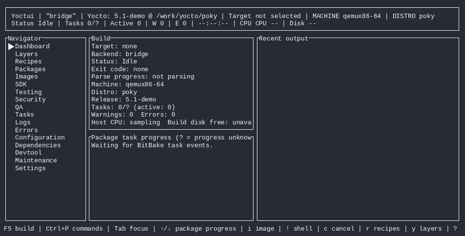
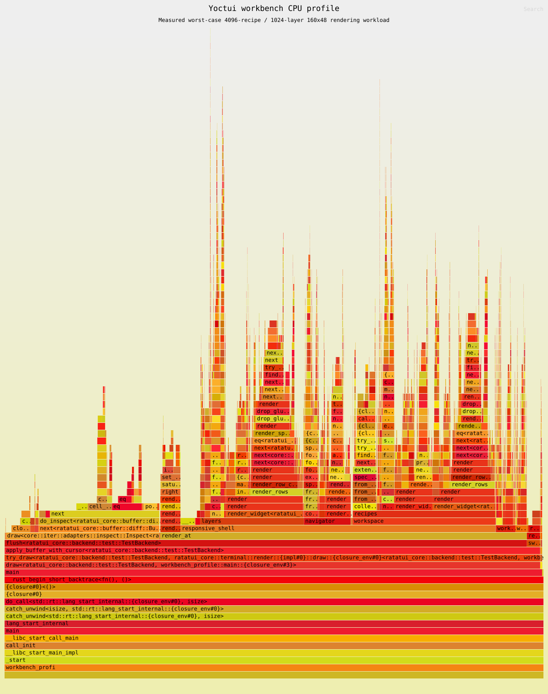

# Yoctui

> One terminal. Your whole Yocto workspace.

[](https://www.rust-lang.org/)
[](https://ratatui.rs/)
[](https://www.yoctoproject.org/)
[](docs/implementation-status.md)

Yoctui is a Rust/Ratatui workbench for Yocto and BitBake. Browse layers and
recipes, edit metadata, run builds and Devtool, inspect dependencies, follow
tasks and logs, launch QEMU, create Wic images, and handle QA or maintenance
without losing your terminal context. BitBake remains the authority; Yoctui
organizes and controls it.



_Recorded from the real Yoctui binary using deterministic fixture metadata so
the demo is reproducible. Live compatibility is documented separately and is
never inferred from this recording._

## What is inside

- **Build cockpit** — confirmed image/recipe builds, task progress, logs,
  structured errors, CPU/memory/disk telemetry, cancellation, and history.
- **Metadata workbench** — layer tree, recipe browser, syntax-aware preview,
  in-TUI editing, configuration provenance, BBMASK, dependencies, and
  signatures.
- **Yocto workflows** — Devtool, packages, SDK, QEMU, Wic, Testing, CVE/SPDX,
  QA, sstate, release, and maintenance tools.
- **Terminal-native UX** — responsive layouts, command palette, contextual
  shortcuts, themes, persisted sessions, shell escape, and external editor
  support.

## Install

Use a UTF-8 Linux terminal with Python 3 and stable Rust/Cargo. Your Poky
release also requires its documented host packages.

Install the published release from crates.io:

```sh
cargo install yoctui --locked
yoctui --version
yoctui --help
```

To build directly from the repository instead:

```sh
export YOCTUI_DIR="$HOME/projects/yoctui"

command -v git python3 rustc cargo
git clone https://github.com/0xbadcaffe/yoctui.git "$YOCTUI_DIR"
cd "$YOCTUI_DIR"
cargo install --locked --path crates/yoctui-cli
yoctui --help
```

For development, use:

```sh
cd "$YOCTUI_DIR"
cargo build --locked -p yoctui
cargo build --locked --release -p yoctui
```

When testing unreleased source after installing the same version from
crates.io, refresh Cargo's executable explicitly; `yoctui --version` alone
cannot distinguish two builds of version 0.1.0:

```sh
cargo install --path crates/yoctui-cli --locked --force
type -a yoctui
```

For an exact local release-artifact check, install and compare that artifact:

```sh
cargo build --locked --release -p yoctui
install -m 755 target/release/yoctui "$HOME/.cargo/bin/yoctui"
cmp target/release/yoctui "$HOME/.cargo/bin/yoctui"
```

## Quickstart: Poky build environment

Start from a complete Poky checkout containing `oe-init-build-env`. Set
`BUILDDIR` before sourcing Poky's environment script: it is both the directory
Poky creates/uses for the build and the directory Yoctui opens.

```sh
export POKY_DIR="$HOME/src/poky"
export BUILDDIR="$POKY_DIR/build-yoctui"

test -f "$POKY_DIR/oe-init-build-env" || {
  echo "missing $POKY_DIR/oe-init-build-env; use a complete Poky release" >&2
  exit 1
}
source "$POKY_DIR/oe-init-build-env" "$BUILDDIR"

yoctui --backend bridge --build-dir "$BUILDDIR"
```

Inside Yoctui, press `B`, press `e`, enter `core-image-minimal`, select the
build action, and confirm it. The first BitBake build starts from that explicit
TUI confirmation.

## Dynamic Yocto compatibility

**Yoctui functionality is Yocto-feature-correlated.** The installed Yoctui
binary defines what Yoctui knows how to do; the connected build environment
determines which of those behaviors and implementations are available now.
The UI is generated from the daemon-owned capability snapshot, never from the
Yoctui version alone or an executable merely present on the host `PATH`.

The same binary can therefore behave differently across workspaces. If a
connected Devtool does not expose `upgrade`, the action remains discoverable
but disabled with the exact reason, for example “Current Devtool does not
expose the upgrade subcommand.” For a BitBake variable query, a positively
probed `bitbake-getvar --value` selects the native implementation; an
environment that lacks it may use the separately verified `bitbake -e`
fallback. Yoctui never emits an unverified `bitbake --getvar` option.

Older environments keep every safely verified workflow and explain unavailable
newer behavior. Unknown future releases are not rejected by their version:
positive probes can enable behavior, while uncertain operations remain
`Unknown` and cannot spawn a command. An environment outside the support
policy still opens in diagnostic/degraded mode instead of taking down the
whole application.

Open **Environment / Compatibility** from the Navigator or use `F10`/`Ctrl+P`
and choose **Open Compatibility**. It shows detected identity, capability
states, exact reasons, selected implementations, and bounded evidence. Filters
`1`–`5` select Available, Limited, Unavailable, Unknown, and Unsupported; `/`
searches the report. Doctor exposes the same daemon snapshot:

```sh
yoctui --build-dir "$BUILDDIR" doctor
yoctui --build-dir "$BUILDDIR" doctor --json
```

The exact Scarthgap 5.0.19 / BitBake 2.8.1 and Wrynose 6.0.2 / BitBake 2.18.0
revisions bound the current **Claimed supported** window. Capabilities are still
probed independently; this claim does not cover an unrecorded point revision,
fixtures, or an optional development snapshot. Live records expire after 90
days and after relevant capability-contract changes. See the
[compatibility contract](docs/compatibility.md) and
[release matrix](docs/compatibility-matrix.md) for exact revisions, scope, and
renewal policy.

## Optional project profile

Yoctui works normally without a profile. A team may optionally commit
`.yoctui/project.toml` at the Poky/project root to share favorites, typed build
presets, and typed workflow intent without modifying Poky, vendor layers,
recipes, or BitBake configuration:

```toml
schema_version = 1

[favorites]
recipes = ["base-files"]
images = ["core-image-minimal"]
layers = ["core"]

[[build_presets]]
name = "minimal"
targets = ["core-image-minimal"]
machine = "qemux86-64"

[build_presets.options]
jobs = 8
continue_on_error = false

[[workflows]]
name = "refresh-metadata"

[[workflows.steps]]
type = "refresh_metadata"
```

Logical recipe, image, and layer names are portable. File references, when a
typed workflow supports them, must be repository-relative and cannot escape
the project root. Host paths, credentials, environment snapshots, shell
fragments, arbitrary commands, and executable hooks are rejected. Themes,
recent paths, aliases, trust decisions, and other personal preferences remain
in the user-local configuration.

Loading the file is inert: it never runs a command, sources an environment,
changes metadata, or starts a build. Yoctui resolves its team intent against
the current BitBake inventory and visibly marks missing or ambiguous entries;
BitBake remains authoritative. Selecting a resolved preset or workflow still
uses the normal preview, capability checks, and confirmations.

After sourcing the Poky environment, inspect resolution without opening the
full-screen client:

```sh
yoctui --backend bridge --build-dir "$BUILDDIR" profile
```

An absent file reports `project profile: absent (optional)`. Unknown fields,
unsupported schema versions, symlinked profile files, and invalid portable
references fail closed with a diagnostic.

## Essential controls

| Key | Action |
|---|---|
| `F5` | Open Logs |
| `B` | Image build options |
| `r` / `y` | Recipes / Layers |
| `Ctrl+P` | Command palette |
| `Tab` | Move focus |
| `!` | Open an inherited Yocto shell; `exit` returns |
| `?` | Contextual help |
| `q` | Quit |

The footer shows the highest-priority current-context shortcuts that fit;
`F1` Help lists the complete shared function-key catalog. Destructive
operations show an exact preview and require confirmation.

## Daemon and persistent sessions

Yoctui can run a persistent per-user daemon that owns BitBake jobs and terminal
sessions while interactive clients attach, detach, and reconnect.

```sh
yoctui daemon start
yoctui daemon status
yoctui daemon restart
yoctui daemon stop
yoctui daemon build core-image-minimal
yoctui attach
yoctui sessions
yoctui session attach <id>
yoctui session kill <id> --force
```

With the daemon running for the selected workspace, Doctor reports the same
validated compatibility authority used by attached clients. Human output keeps
the existing environment/bridge checks; `--json` emits only the bounded typed
compatibility report for automation:

```sh
yoctui --build-dir "$BUILDDIR" doctor
yoctui --build-dir "$BUILDDIR" doctor --json
```

If the daemon is disconnected, its snapshot is absent, or protocol values are
invalid, Doctor reports that state explicitly and does not infer support from
the host PATH or the requested release name.

On a host with a systemd user manager, install the no-root user unit and enable
automatic startup:

```sh
yoctui daemon service install
systemctl --user enable --now yoctui.service
yoctui daemon service status
```

`yoctui daemon service start|stop|restart|status|uninstall` manages only the
user unit. If `systemctl --user` is unavailable, use the direct-process
`yoctui daemon start` fallback. `yoctui daemon foreground` is the debug/service
entry point. Daemon persistence does not mean arbitrary processes survive a
host reboot; recovery states and guarantees are implemented and documented by
later milestone tasks.

`yoctui attach` opens the interactive client against the local daemon.
`yoctui sessions` lists daemon-owned PTYs. `yoctui session attach <id>` checks
that a session is available for the interactive client, while terminating a
session requires the explicit `--force` flag.

The interactive client may be detached with the configured prefix command;
detaching or closing the client does not stop daemon-owned jobs or PTYs. A new
client on the same build host reconnects through the per-user Unix socket. SSH
reconnect uses the same workflow: the daemon stays on the build host and the
next `yoctui attach` restores the current snapshot and session list. No TCP
daemon is exposed by default.

Daemon sockets and persisted metadata are user-private. Peer UID checks,
canonical runtime paths, bounded frames/logs/scrollback, typed commands, and
normal destructive confirmations apply to daemon management and PTY control.
For a controlled live Poky acceptance run, use
`YOCTUI_LIVE_POKY_TARGET=core-image-minimal ./scripts/live-daemon-poky.sh`;
set `YOCTUI_LIVE_CACHE=/path/to/cache` to retain downloads and sstate between
runs. `YOCTUI_DAEMON_LOG=/path/to/daemon.log` enables daemon diagnostics when
debugging a foreground service startup. The live harness fails closed when
Poky's host prerequisites are unavailable.
After a host reboot, persisted metadata is restored but arbitrary child
processes and PTYs are reported Lost; only an explicit supported relaunch may
restart them. Fresh official Scarthgap 5.0.19 and Wrynose 6.0.2 daemon runs are
recorded in the compatibility evidence; their exact tested scope does not imply
that arbitrary child processes survive a host reboot.

## Performance evidence

The completion gate captured the deterministic release workload with real
`perf` samples through `cargo-flamegraph`. Open the image for the full
interactive SVG.

[](artifacts/flamegraph/yoctui.svg)

Reproduce it on a host that permits perf sampling:

```sh
cargo install flamegraph
./scripts/flamegraph.sh
```

## Learn more

- [Operator guide](docs/operator-guide.md) — daily workflows and troubleshooting
- [Compatibility evidence](docs/compatibility.md) — live, fixture, and host validation boundaries
- [Release compatibility matrix](docs/compatibility-matrix.md) — support classifications, exact tested revisions, and renewal policy
- [UI specification](docs/ui-spec.md) — screens, focus, dialogs, and shortcuts
- [Architecture](docs/architecture.md) — crate boundaries and state flow
- [Testing](docs/testing.md) and [profiling](docs/profiling.md) — verification and performance
- [Implementation status](docs/implementation-status.md) — complete task evidence

## Development checks

```sh
cargo fmt --all --check
cargo test --workspace --all-features
cargo clippy --workspace --all-targets --all-features -- -D warnings
python3 -m pytest bridge/tests
./scripts/verify-roadmap.sh
```

Use `./scripts/verify-completion.sh` for the strict clean-checkout completion
gate. Live BitBake support is claimed only for combinations recorded in
[compatibility evidence](docs/compatibility.md).
