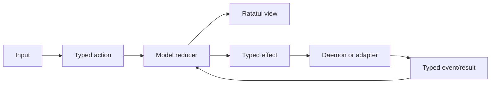

# Architecture

The client owns presentation; the persistent daemon owns work; BitBake owns
metadata/outcomes. Closing a client leaves daemon builds running.

## Components

| Crate | Responsibility |
| --- | --- |
| `yoctui-model` | Typed state/actions, pure reducers, focus, selection, retention, catalog. |
| `yoctui-protocol` | Framing, versions, correlation, sequence/generation validation. |
| `yoctui-bitbake` | Adapters, discovery, artifact parsing, cancellation. |
| `yoctui-app` | Input routing, normalized events, effects, client replicas. |
| `yoctui-ui` | Ratatui views, layouts, styles, cell snapshots. |
| `yoctui` | Startup, workers, daemon/client runtimes, persistence, process ownership. |
| `yoctui-shell` / `yoctui-utils` / `yoctui-e2e` | Shell helpers, shared utilities, end-to-end support. |

## Data flow

The model does no I/O; renderers do not parse backend output. Workers keep I/O
outside input/render loops. Requests/results bind workspace, selection, full daemon
instance, and generation; stale results cannot install. Reconnect replays retained
events or obtains a snapshot.

## Builds and bounded state

Aggregate counters are independent of retained rows; unknown totals stay unknown.
Duplicate completions cannot advance twice; success cannot turn Lost tasks into
successes. Timings use observations. Recovery reserves non-Raw job IDs without
restoring process/cancellation ownership.

Logs, journals, queues, task history, scrollback, and results are bounded with
loss/partial states. Progress coalesces only between ordering barriers;
failure/terminal transitions are correctness sentinels. Slow clients cannot block
others. Model-owned logs project at most 256 KiB into `tui-logger`.

## Environment and operations

Daemon [capabilities](compatibility.md) use initialized metadata, bounded probes,
negotiated APIs, and conservative fallbacks; client PATH cannot enable actions.
Bridge stdout is NDJSON; stderr has a bounded tail. Typed argv reviews revalidate
identity/capability/paths before execution; cancellation affects owned work.
Atomic saves preserve permissions and detect conflicts; editors allow 1 MiB.
Rootfs/debugger discovery uses exact image/provider metadata and retains missing data.

## Terminal ownership

The daemon owns PTYs, emulation, resize, scrollback, and writer leases. `tui-term`
renders typed cells without parser/controller features. Only writers send keys/resize.
Pane close/detach keeps processes; termination requires confirmation. The `!` shell
belongs to the client. See [Terminal sessions](terminal-sessions.md).

## Widget integration boundary

The typed catalog drives menus, palette, Help, footers, mouse routes, and bindings.
Widgets project model state without extra selection/scroll authority. Throbbers use
model animation; rootfs charts pair exact text. Suffixes do not prove raster MIME.
See [Widgets and dependencies](widgets-and-dependencies.md).

## Rendering and persistence

Dirty views normally present at 4 Hz; saturated cosmetics/clock use 1 Hz. Input
is independent; hidden telemetry and reduced motion avoid extra frames.
[Performance](performance.md) defines limits.

Startup uses CLI/environment/config/session/defaults. Preferences save atomically,
separately from transient focus/inspector; launch flags preserve stored choices.
Profiles exclude host paths, credentials, and executable hooks. Invalid/future
schemas preserve working state. [Testing](testing.md) defines boundary validation.
