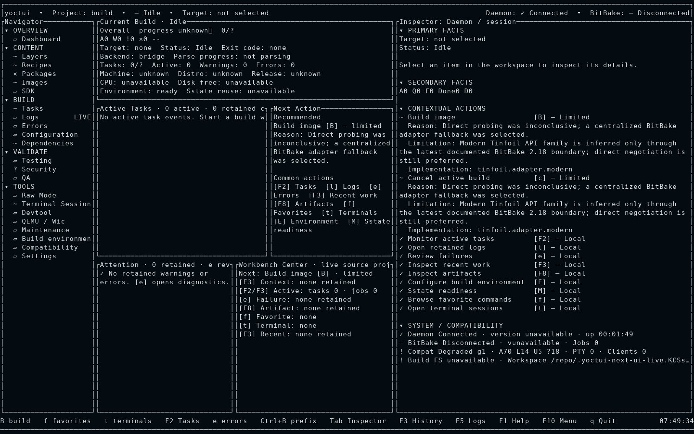
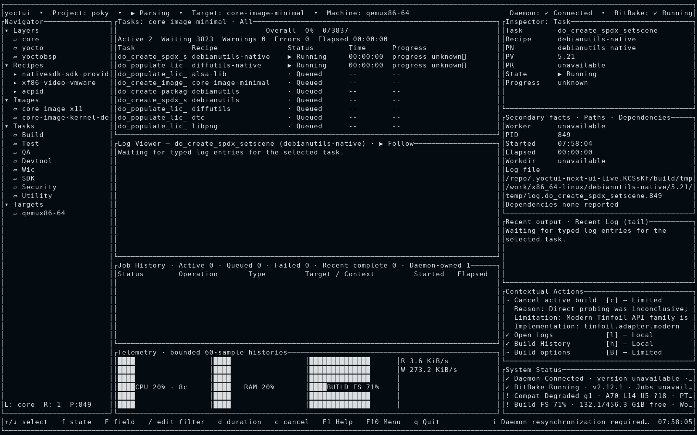
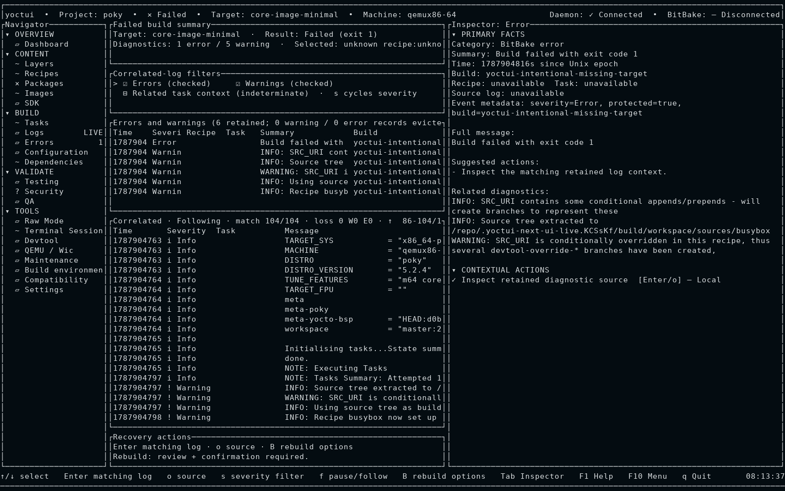
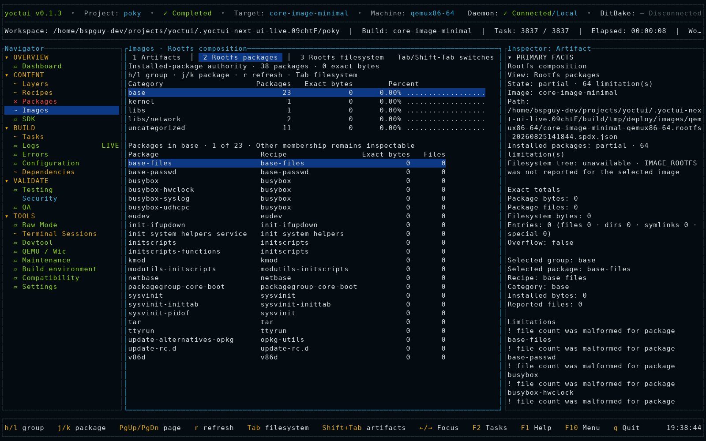
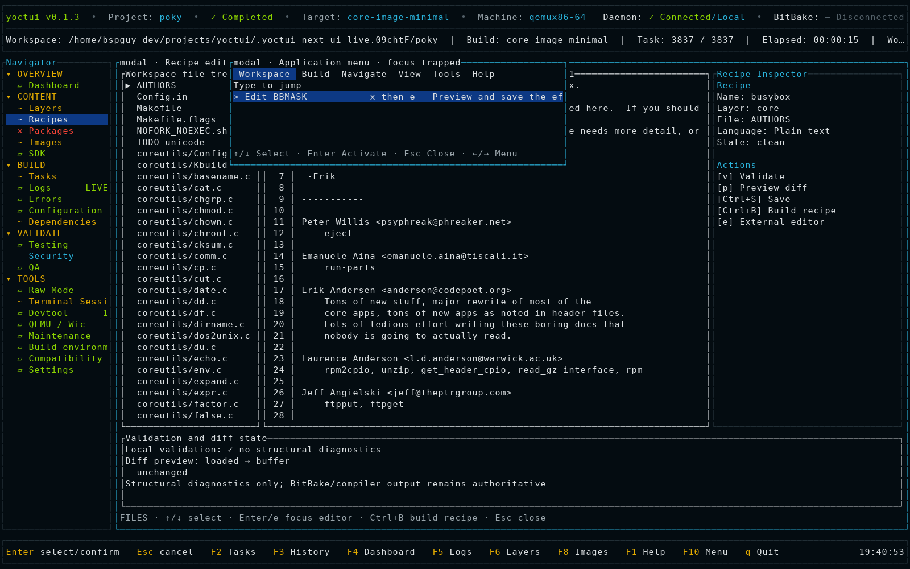
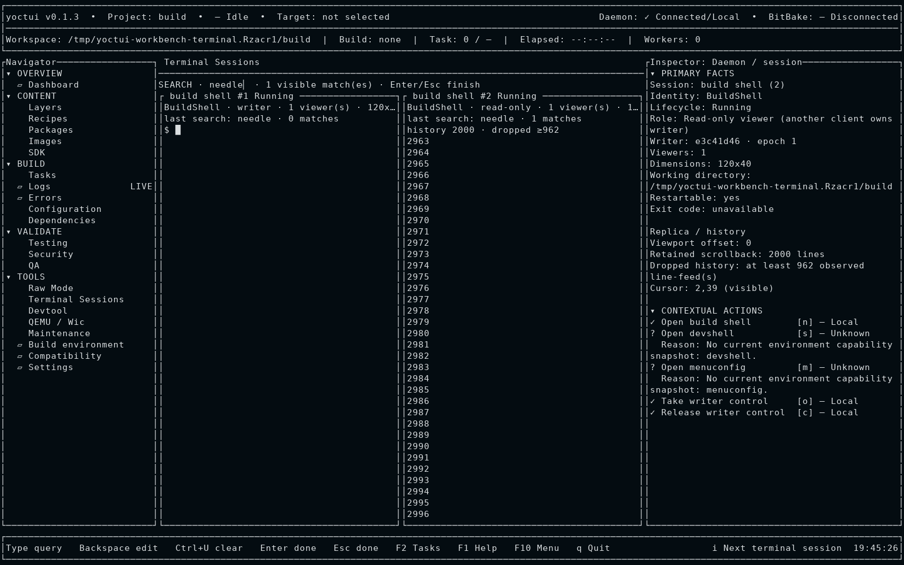

# Historical real Yoctui scenario evidence

These six screens were captured from a real Yoctui client connected to a
supported-host daemon while exercising the M22 workflows. They preserve that
exact workflow run. They are historical capture evidence, not the current
visual target and not a claim that the old layout resembles M21. They are distinct from the
[deterministic production-cell rasters](../production-raster/README.md), which
are regenerated from the current production renderer.

Capture identity:

- Yoctui source commit: `2c330c14e5f08b0d2602f57b84a8fad49a9ee39d`
- Yoctui binary SHA-256: `bc2d31a044a99cfbd169733558ab785509953eb9e16a8dd454cbb96b6874ff3b`
- host: Ubuntu 24.04.4 LTS, glibc 2.39
- Yocto/Poky: 5.2.4 at `d0b46a6624ec9c61c47270745dd0b2d5abbe6ac1`
- BitBake: 2.12.1
- machine/target: `qemux86-64` / `core-image-minimal`
- terminal/raster size: `160x50` cells / `1600x1000` pixels

The authoritative attribution, interactions, semantic assertions, terminal
streams, and checksums remain in
[`artifacts/release-quality/m22-concept-live`](../../../../artifacts/release-quality/m22-concept-live/manifest.json).
The local [`manifest.toml`](manifest.toml) pins the exact design copies.

<!-- REAL-YOCTUI-REGRESSION-SCREENS:START -->

## 1. Idle dashboard

Real idle client connected to the supported-host daemon.



## 2. Active build tasks

Real `core-image-minimal` build with authoritative BitBake task activity.



## 3. Failed build errors

Real Errors workspace after the intentionally failed build scenario.



## 4. Rootfs composition

Real image artifact and installed-package composition for the built rootfs.



## 5. Recipe editor and application menu

Real recipe editor with the focus-trapped F10 application menu composed above
it.



## 6. Terminal sessions

Real daemon-owned terminal sessions showing writer/read-only ownership and
retained scrollback/search state.



<!-- REAL-YOCTUI-REGRESSION-SCREENS:END -->

## Evidence-integrity contract

Run:

```bash
python3 scripts/test-m22-live-design-gallery.py
./scripts/verify-m22-concept-parity.sh
```

The gallery test rejects missing or extra scenarios, reordered or broken image
links, changed capture identity, stale hashes, wrong dimensions, and any design
PNG that is not byte-identical to its attributed supported-host live raster.
It protects historical attribution; visual acceptance uses the current
production-cell rasters until a fresh six-scene live capture replaces this
evidence. Do not regenerate these files from a fixture or concept image.
