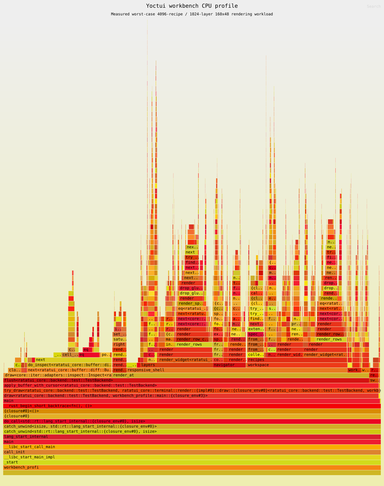

# Profiling

Use an optimized binary, exact source identity, and an explicit scenario.
[Performance](performance.md) defines limits; profiler timing is diagnostic.

| Purpose | Command |
| --- | --- |
| Renderer fixtures | `./scripts/profile-workload.sh` |
| UI/workbench ceilings | `./scripts/test-next-generation-ui-performance.sh`, `./scripts/test-workbench-ux-performance.sh` |
| Exact running processes | `./scripts/capture-runtime-profile.sh --help` |
| Flamegraph | `./scripts/flamegraph.sh`, then `./scripts/test-flamegraph.sh` |
| Memory policy | `./scripts/valgrind.sh`, then `python3 -m unittest scripts/test_valgrind_policy.py` |
| Live build | `./scripts/capture-real-poky-performance.py --help` |

## Renderer and process profiles

Renderer ceiling: 10,000,000 ns/frame; YOCTUI_UI_PERF_MAX_NS_PER_FRAME may lower it.
Cover idle/build/log/task/metadata/editor/graph/rootfs/terminal scenes. Allocate visible
rows; add caches only with measured invalidation/memory justification. Runtime profiles
record PID/source/binary/host/scenario, symbols, samples, unresolved weight, and hashes.

## Flamegraph

Install with `cargo install flamegraph --locked`; usable perf permissions are also
required. SVG and summary live in artifacts/flamegraph/; sampling/checksum checks apply.
The historical v0.1.64 capture (September 6, 2026) has 6,000 frames,
2,403 real userspace samples, checksum `95d507f9b14b71d6`, and no unresolved frames.
It is not a current-source performance claim.

[Machine-readable summary](../artifacts/flamegraph/summary.txt).
YOCTUI_PROFILE_TARGET_DIR selects benchmark cache; YOCTUI_FLAMEGRAPH_BUILD_TARGET_DIR
isolates frame-pointer builds without changing acceptance.

## Memory and live evidence

Valgrind compares 16/128-frame runs. Invalid accesses, definite/indirect leaks,
unknown stacks, growth, unexpected descriptors, or incomplete execution fail.
The only fixed-cache exception is ten pinned allocations: tui-logger 34,995 bytes
plus Jiff 4,372 bytes, maximum 39,367 bytes. check_valgrind.py pins sizes/stacks/
versions/checksums; categories cannot grow. Changes require separate review.

Live evidence needs exact initialized build/target/configuration, source/binary,
parallelism, sustained task interval, CPU/latency/memory, hashes, and freshness.
Measure CPU without Cargo/profiler sharing the window. Label partial builds;
fixtures and old captures cannot certify current performance or completed boot.
